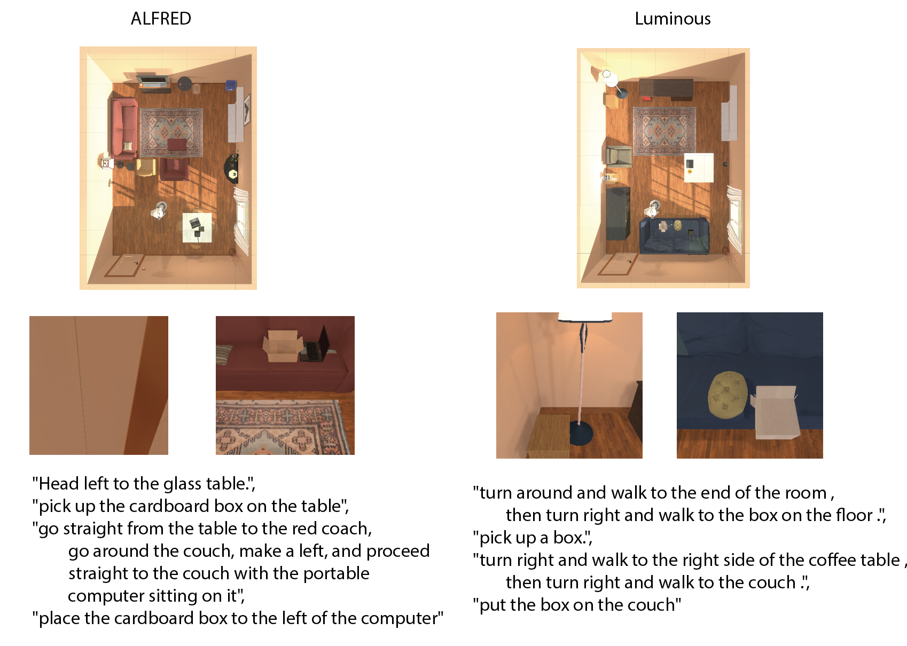

**Luminous** is a framework for testing the performance of Embodied AI (EAI) models in indoor tasks. Generally, we intergrete different kind of functionalities into this repository that are related to evaluate EAI performance for indoor tasks. The **Indoor Scene Synthesis** module provides different methods for synthesize randomized indoor scenes that be visualized in Unity Engine. The **Luminous for Alfred** offers the complete pipline to conduct data augmentment such as generating Alfred tasks in Luminous, solving the trajectories of tasks, rendering images, and generating natural language descripitions. 


|   Simulator   | Layout randomization | Small Object Randomization | Object Material randomization  | Number of rooms | Number of objects |
|:-------------:|:---------------------:|:----------------:|:-----------:|:--------------:|:--------------:|
|     Habitat    |           x            |         x        |      x      |        120       |       1000+?        |
|     Virtualhome    |           x            |         x        |      ✓      |        7 (houses)       |       357        |
|     ThreeDworld    |           x            |         ✓        |      ✓      |        100+?       |       2500        |
|     iGibson    |           x            |         ✓        |      x       |        106 (houses)       |       1984        |
|     AI2Thor    |           x            |         ✓        |      ✓      |        227       |       2000        |
|     Luminous + AI2Thor    |           ✓             |         ✓        |      ✓      |        ∞       |       2000        |


# Feature Highlights
We highlight the features of Luminous here and readers may go directly into the modules for detailed implementations.

## 1. Indoor scene synthesis
We present Constrainted Stochastic Scene Generation in Luminous, which generates high-quality scene from the a graph-based representation of indoor scenes. By specifying the required objects and relationships between objects, we can sample an unlimited number of indoor scenes that satisfy the constraints.


|   Algorithm   | Scene Graph Inference | Scene Generation | Constrained | RGBD rendering |
|:-------------:|:---------------------:|:----------------:|:-----------:|:--------------:|
|     PlanIT    |           ✓           |         x        |      x      |        x       |
|     Grains    |           x           |         ✓        |      ✓      |        ✓       |
|     3DSLN     |           x           |         ✓         |     ✓        |      ✓          |
| Human-Centric |           x           |         ✓        |      x      |        x       |
|      CSSG     |           ✓           |         ✓        |      ✓      |        ✓       |


## 2. Luminous for Alfred

We can generate Alfred trajectories from Luminous. After taking the task descriptions in Alfred, we apply the **Task Parser** to get the required indoor scenes. Then, a **Task Sampler** sample the tasks for Alfred challenge. Finally, we can add **Natural Language Descriptions** along with agent actions.

## 3. EAI Evaluation

We evaluation three models on Luminous for Alfred challenge.

- MOCA
- ET
- HiTUT

See **EAIEvaluation** folder for more details.




# Folder structure

```
Luminous
│   readme.md   
│
└─── [EAIEvaluation](EAIEvaluation/readme.md)
│   │   ET
│   │   MOCA
│   │   HiTUT
└───IndoorSceneSynthesis
│   │   3DFrontToolBox
│   │   ContrainedStochsticIndoorScene
│   │   LearningBasedMethod
│   │   └───3DSLN
│   │   └───DeepSynth
└───Luminous4Alfred
│   │   NaturalLanguageTool
│   │   TaskParser
│   │   TaskSampler
│   │   TaskSolver
    
```
